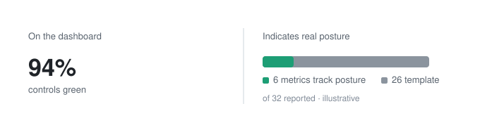
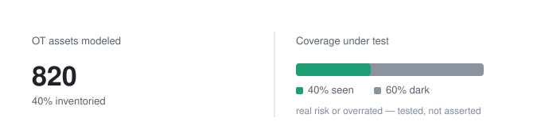
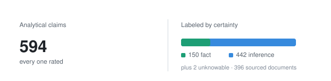
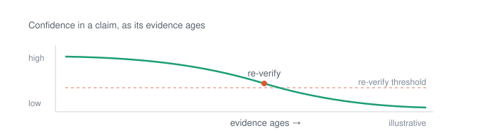
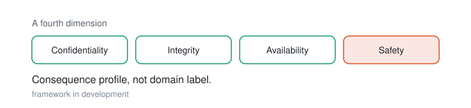
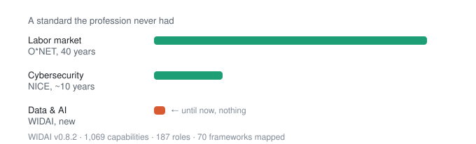

# Thomas Jones

**Chief Data &amp; AI Officer · CISO**

Global Head of Security &amp; GRC at an NYSE manufacturer. CISO of a PE-backed platform. Six years running OT inside a DAX 40 WEF Lighthouse factory. Co-author of U.S. national cybersecurity standards through MITRE and CIS. Issued U.S. patent. Carnegie Mellon CDAIO, third cohort.

Security, data, and AI are one discipline seen from different altitudes. What follows is organized by what that discipline does for an organization, with the work underneath each as evidence. The full index of repositories is at the bottom. Built, not asserted.

---

## Risk in business terms

*Security and operational risk expressed as financial exposure a board can price and challenge. Not maturity scores, not fear.*

### Are we measuring what matters, or just what the template lists?

Most programs report what the framework prescribes. Coverage, maturity, control counts. The numbers move, the board nods, and almost none of it tracks where the organization actually stands. This work is built to tell the difference: which indicators track real posture and consequence, and which are template metrics that only look like measurement.

Built on the Secure Controls Framework. *Private repository* · framework: [securecontrolsframework](https://github.com/thehipsterciso/securecontrolsframework)

### Is the OT you can't see a real risk, or just an expensive thing to chase?

A Monte Carlo model that tests a real industry argument instead of arguing about it. Bryson Bort made the case at S4x26 that OT asset visibility is overrated, since you cannot act on what you can only see. This puts that position against the counter-claim, that inventory is the prerequisite to segmentation, response, and risk quantification, and runs both through a synthetic $340M manufacturer carrying 820 OT assets at 40% coverage. Ten hypotheses, turned from a debate into a calculation.

→ [ot-visibility-model](https://github.com/thehipsterciso/ot-visibility-model)

---

## Governance and decision integrity

*Data and AI governed so the decisions built on them hold up. Provenance, honest evidence, and consequence as the variable that actually governs.*

### Most due diligence presents inference as fact. This labeled which was which.

A full knowledge graph built on one public technology company, from public sources only, with every analytical claim tagged for what it actually was. Of 594 claims, three-quarters are marked inference, a quarter fact, and a few named as things the evidence simply cannot settle. The number that matters here is not how many entities the graph holds. It is that the analysis tells you how much of itself to trust.

→ [hc-cdaio-kg](https://github.com/thehipsterciso/hc-cdaio-kg)

### Knowledge systems store conclusions. They forget how sure anyone was.

So a finding becomes a fact, decisions get built on top of it, and when something fails downstream nobody can trace it back. This platform persists the reasoning, not just the result. Provenance on every claim, and confidence that decays as the evidence behind it ages, so the system knows what it no longer knows. The platform builds itself under governance: nine repositories, forty components, an autonomous build with a seven-stage quality gate and two independent reviewers before anything merges.

*Private repository · nine-repo architecture.*

### Diligence that sources and rates everything it finds.

A thirteen-agent system for structured competitive and acquisition research. Planning, parallel specialist collection, independent verification, synthesis. Corporate and ownership structure, funding history, technology and vendor landscape, hiring signals, M&amp;A activity, public sentiment, each finding sourced and confidence-rated rather than asserted.

*Private repository.*

### When a system can hurt someone, the CIA triad runs out of room.

Early work on a fourth axis. Confidentiality, integrity, availability, and safety, treated as a consequence profile rather than a domain label, because whether a system is labeled IT or OT tells you far less about how to govern it than what happens when it fails. This is forming, not finished, and the model is being worked out in the open.

*In development.*

---

## Value and the enterprise as a system

*The organization, its data, and its dependencies modeled as one connected system, so value and risk are visible before a decision instead of after.*

### The structure that matters is the one nobody drew.

Most decisions get made against the org chart, which is the official version, not the real one. This platform builds the real one. A connected model of people, systems, vendors, data, and obligations, so the dependency that would actually break the business is visible before the decision rather than discovered after it.

→ [hc-enterprise-kg](https://github.com/thehipsterciso/hc-enterprise-kg) · components: [enrich](https://github.com/thehipsterciso/hc-enterprise-kg-enrich) · [gateway](https://github.com/thehipsterciso/hc-enterprise-kg-gateway) · [infra](https://github.com/thehipsterciso/hc-enterprise-kg-infra) · [web](https://github.com/thehipsterciso/hc-enterprise-kg-web)

### Identity spend that doesn't map to need

Machine-learning models that surface the drift between the licenses and permissions an identity estate carries and what people actually use. The output is a financial case for rightsizing, not a security score.

→ [defender-for-identity-ml](https://github.com/thehipsterciso/defender-for-identity-ml)

---

## Standards and independent contribution

*Authority that compounds because it comes from building the field, with no vendor stake in any conclusion.*

### Labor markets got O*NET. Cybersecurity got NICE. Data and AI got nothing.

Forty years of structured workforce taxonomy for the broad labor market, a decade of it for cybersecurity, and for the one function boards are betting their future on, no shared language at all. WIDAI is the attempt to close that gap. A machine-readable, cross-framework taxonomy that folds 70 vendor and government frameworks into one neutral standard, so a board or a PE firm can measure workforce capability against something other than a vendor's marketing.

→ [widai-dataset](https://github.com/thehipsterciso/widai-dataset)

### Conforme

The C++ library behind an issued U.S. patent, written for authoring OVAL, the language standards bodies use to formally define vulnerability and configuration state. It came out of direct submission work to MITRE and CIS, which has a way of teaching you what a standard actually requires versus what you assumed it did.

→ [conforme](https://github.com/thehipsterciso/conforme)

### Writing and methods

*Uncomfortable Intelligence* — independent practitioner writing at the intersection of data strategy, AI governance, and security leadership. Underneath it: an ensemble approach to early-stage thinking and the document and review skills that keep formal writing honest before it ships.

→ [thehipsterciso.com](https://www.thehipsterciso.com) · [substack](https://github.com/thehipsterciso/substack) · [brainstorming](https://github.com/thehipsterciso/brainstorming) · [adversarial-panel](https://github.com/thehipsterciso/hc-claude-skill-adversarial-panel) · [docbook](https://github.com/thehipsterciso/hc-claude-skill-docbook)

---

## Full index

Every repository, public and private.

**Platforms &amp; datasets** — [hc-enterprise-kg](https://github.com/thehipsterciso/hc-enterprise-kg) ( [enrich](https://github.com/thehipsterciso/hc-enterprise-kg-enrich) · [gateway](https://github.com/thehipsterciso/hc-enterprise-kg-gateway) · [infra](https://github.com/thehipsterciso/hc-enterprise-kg-infra) · [web](https://github.com/thehipsterciso/hc-enterprise-kg-web) ) · [hc-cdaio-kg](https://github.com/thehipsterciso/hc-cdaio-kg) · [widai-dataset](https://github.com/thehipsterciso/widai-dataset)

**Models &amp; research** — [ot-visibility-model](https://github.com/thehipsterciso/ot-visibility-model) · [defender-for-identity-ml](https://github.com/thehipsterciso/defender-for-identity-ml) · [conforme](https://github.com/thehipsterciso/conforme) · [securecontrolsframework](https://github.com/thehipsterciso/securecontrolsframework)

**Methods &amp; writing** — [brainstorming](https://github.com/thehipsterciso/brainstorming) · [adversarial-panel](https://github.com/thehipsterciso/hc-claude-skill-adversarial-panel) · [docbook](https://github.com/thehipsterciso/hc-claude-skill-docbook) · [substack](https://github.com/thehipsterciso/substack)

**Private** — Reasoning Graph Platform (nine repositories) · measurable-cybersecurity · hc-claude-osint · CIAS (in development)

---

[thehipsterciso.com](https://www.thehipsterciso.com) · [LinkedIn](https://www.linkedin.com/in/thehipsterciso/)

PGP: `a14544d8e04c62926e5887605973310129535708`
